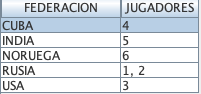

# USANDO LISTAGG PARA AGREGAR RESULTADOS EN UN CAMPO

Del video de Christian Larsen: https://www.youtube.com/watch?v=MlItx1gd1Xc

En una tabla podemos tener campos donde el valor almacenado se repite, como el código postal, el país, o algún otro tipo de clave.

Lo que hacemos para obtener el número de filas que tienen ese valor es un GROUP BY.

Pero a veces lo que queremos obtener es la lista de, por ejemplo, clientes que son de un país, pero todos los clientes en una fila.

En este ejemplo de uso de LISTAGG vamos a trabajar con la tabla AJEDRECI, que tiene la siguiente información:


Queremos obtener que ajedrecistas (id) pertenecen a la federación de RUSIA, USA, CUBA, INDIA Y NORUEGA

Con GROUP BY el resultado es:

```
SELECT FEDERACION, COUNT(ID)
FROM JOMUMA1.AJEDRECI
GROUP BY FEDERACION
```


Sabemos que hay 2 ajedrecistas rusos, pero no queremos obtener así el resultado. Queremos saber que ids son jugadores rusos, que ids son jugadores de la India...

Vamos a usar la función LISTAGG.

Su función es agregar un conjunto de elementos String en un String, concatenándolos. Se puede usar un separador entre cada par de elementos String.

```
SELECT FEDERACION, LISTAGG(ID, ', ') WITHIN GROUP (ORDER BY ID ASC) AS "JUGADORES"
FROM JOMUMA1.AJEDRECI
GROUP BY FEDERACION;
```



Imaginemos que en el campo FEDERACION, en vez de aparecer directamente el país, apareciera un código. Si quisiéramos obtener el nombre del pais (imaginemos la tabla PAIS_FEDERACION), la consulta quedaría así:

```
SELECT F.FEDERACION, P.PAIS, LISTAGG(F.ID, ', ') WITHIN GROUP (ORDER BY F.ID ASC) AS "JUGADORES"
FROM JOMUMA1.AJEDRECI F
INNER JOIN PAIS_FEDERACION P ON F.FEDERACION = P.ID
GROUP BY F.FEDERACION, P.PAIS;
```

Y, por supuesto, todo esto puede usarse en un programa RPG.
