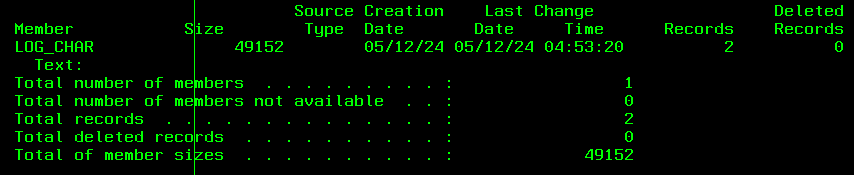

# VARCHAR vs CHAR

Del video de Christian Larsen: https://www.youtube.com/watch?v=HL8JtkryoxQ

Vamos a ver las principales diferencias en programas RPG y en BD.

## RPGLE

Usar campos de texto variable en variables temporales de nuestro RPG puede mejorar el rendimiento de operaciones con strings, a la vez que hace nuestro código más fácil de leer, ya que no hace falta que guardemos en otro campo la longitud del campo de texto, que luego se usaría en operaciones %SUBST, ni tampoco tendríamos que usar %TRIM para ignorar los espacios en blanco extra.

Si un subprocedure va a manejar texto de diferentes longitudes, usar campos de texto de longitud variable para los parámetros como a los campos de return, puede mejorar tanto el rendimiento como la legibilidadd de nuestras llamadas a esos procedures. No hará falta que pasemos parámetros con la longitud de los campos para obtener la longitud real del parámetro.

## BD

La ventaja de usar VARCHAR con respecto a CHAR es que ahorramos espacio, ya que con VARCHAR no vamos a tener los espacios en blanco sobrantes.

## Testing

### RPG

Hay dos programas.

Uno trabaja solo con `char`, llamado `using_char.rpgle` en el que se puede ver que se malgasta memoria para contener un texto que nunca va a tener esa longitud. Además hay uso de `%trim` por todos lados para quitar todos esos espacios en blanco sobrantes.

Ejecutar con el comando `CALL USING_CHAR` y ver el resultado con el comando `dspjoblog`.

El segundo programa trabaja solo con `varchar`, llamado `usevarchar.rpgle` en el que se puede ver que no se usa ningún %trim() por ningún lado, que es más fácil de leer y en el que se usa solo la memoria necesaria para guardar la longitud de un string. Más importante, el rendimiento es mejor.

Ejecutar con el comando `CALL USEVARCHAR` y ver el resultado con el comando `dspjoblog`.

### BD

En la utilidad `run scripts` ejecutar los SQL del fichero `scripts.sql`.

Hemos insertado la misma data en los dos ficheros.

Si en la terminal del 400 ejecutamos: `DSPFD LOG_CHAR` y nos vamos al final veremos que el tamaño es de 49152:

Si en la terminal del 400 ejecutamos: `DSPFD LOGVARCHAR` y nos vamos al final veremos que el tamaño es de 16384:

El ahorro de espacio es considerable.
